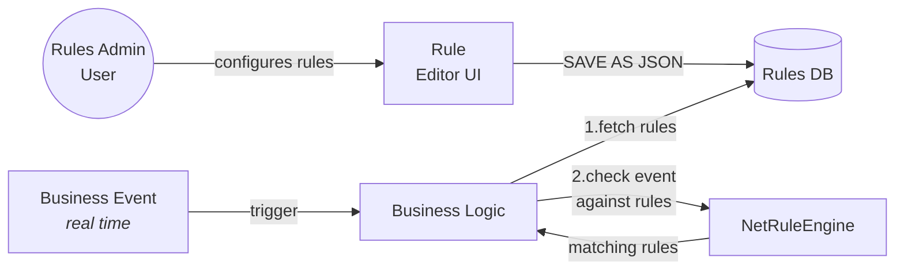

NetRuleEngine
 ==============
C# Rule Engine. High performance object rule matching. Support various complex grouped predicates.
available on [nuget](https://www.nuget.org/packages/NetRuleEngine/).

(Input) An Object + Rule(s) => (Output) Is Match

[](https://www.nuget.org/packages/NetRuleEngine/)
[](https://github.com/AmirSasson/NetRuleEngine/actions/workflows/ci-cd.yml)
[](https://www.nuget.org/packages/NetRuleEngine/)

#### Use cases
- Business rules that are dynamically generated by a user interface, to determine Yes/No conditions
- Audience Matching
- Dynamic Alerts detection

#### Common Usage Scenario

* **Rules Admin** - Actor Role - that sets the rules on design time to identify an event or desired state.
* **Rules DB** - Database to store the rules
* **Business Event** - an Event that occurs on the business flow, and changes a state on your backend, or a standalone event that needs to be tested for rule matching. can be anything as a site Visit, transaction, UI event, Login, Registration or whatever.
* **Business LOGIC** - this is the backend that reference the NetRuleEngine package, consumes the Rules from DB, and for each Event, run the Rule matching and acts according to the result

## Features and Capabilities

### Nested Rules Support
The engine supports unlimited nesting of rule groups, allowing for complex logical expressions. RulesGroups can contain both individual Rules and other RulesGroups, enabling sophisticated rule combinations like:
- `(A AND (B OR C))`
- `(A OR B) AND (C OR (D AND E))`
- `((A OR B) AND C) OR (D AND (E OR F))`

Example of a complex nested rule:
```csharp
var config = new RulesConfig {
    RulesOperator = Rule.InterRuleOperatorType.And,
    RulesGroups = [
        new RulesGroup {
            Operator = Rule.InterRuleOperatorType.Or,
            Rules = [
                new Rule { 
                    ComparisonOperator = Rule.ComparisonOperatorType.Equal,
                    ComparisonValue = "example",
                    ComparisonPredicate = "TextField"
                },
                new RulesGroup {
                    Operator = Rule.InterRuleOperatorType.And,
                    Rules = [
                        new RulesGroup {
                            Operator = Rule.InterRuleOperatorType.Or,
                            Rules = [
                                new Rule {
                                    ComparisonOperator = Rule.ComparisonOperatorType.GreaterThan,
                                    ComparisonValue = "10",
                                    ComparisonPredicate = "NumericField"
                                }
                            ]
                        }
                    ]
                }
            ]
        }
    ]
};
```

### Predicate Types and Operations

Each predicate type supports specific comparison operators and requires proper ComparisonValue formatting:

#### Numbers
- **Supported Operators**: 
  - `Equal`, `NotEqual`
  - `GreaterThan`, `LessThan`
  - `GreaterThanOrEqual`, `LessThanOrEqual`
- **ComparisonValue Format**: Numeric string (e.g., `"5"`, `"10.5"`)
- **Example**:
  ```json
  {
    "ComparisonPredicate": "NumericField",
    "ComparisonOperator": "GreaterThan",
    "ComparisonValue": "10"
  }
  ```

#### Strings
- **Supported Operators**:
  - `Equal`, `NotEqual`
  - `StringStartsWith`, `StringEndsWith`
  - `StringContains`, `StringNotContains`
  - `StringMatchesRegex`
  - `StringEqualsCaseInsensitive`, `StringNotEqualsCaseInsensitive`
  - `StringNullOrEmpty`, `StringNotNullOrEmpty`
- **ComparisonValue Format**: Plain text string
- **Example**:
  ```json
  {
    "ComparisonPredicate": "TextField",
    "ComparisonOperator": "StringStartsWith",
    "ComparisonValue": "prefix"
  }
  ```

#### Collections
- **Supported Operators**:
  - `CollectionContainsAnyOf`: Checks if the collection contains any of the specified values
  - `CollectionNotContainsAnyOf`: Checks if the collection contains none of the specified values
  - `CollectionContainsAll`: Checks if the collection contains all specified values
  - `In`: Checks if a value is in the specified list
  - `NotIn`: Checks if a value is not in the specified list
- **ComparisonValue Format**: Pipe-separated values (e.g., `"1|2|3"`)
- **Example**:
  ```json
  {
    "ComparisonPredicate": "PrimitivesCollection",
    "ComparisonOperator": "CollectionContainsAll",
    "ComparisonValue": "1|2|3"
  }
  ```

#### Composite Objects
- **Access Format**: Use dot notation to access nested properties
- **Example**:
  ```json
  {
    "ComparisonPredicate": "userAddress.StreetAddress",
    "ComparisonOperator": "Equal",
    "ComparisonValue": "123 Main St"
  }
  ```

#### Dictionaries
- **Access Format**: Use bracket notation to access dictionary items
- **Example**:
  ```json
  {
    "ComparisonPredicate": "userDetails[SSN]",
    "ComparisonOperator": "Equal",
    "ComparisonValue": "123-45-6789"
  }
  ```

#### Booleans
- **Supported Operators**: 
  - `IsTrue`: Checks if the value is true
  - `IsFalse`: Checks if the value is false
- **ComparisonValue Format**: Not required for boolean operators
- **Example**:
  ```json
  {
    "ComparisonPredicate": "IsActive",
    "ComparisonOperator": "IsTrue",
    "ComparisonValue": null
  }
  ```

#### Enums
- **Supported Operators**: `Equal`, `NotEqual`
- **ComparisonValue Format**: Enum value name as string
- **Example**:
  ```json
  {
    "ComparisonPredicate": "SomeEnumValue",
    "ComparisonOperator": "Equal",
    "ComparisonValue": "Yes"
  }
  ```

#### DateTime
- **Supported Operators**:
  - `Equal`, `NotEqual`
  - `GreaterThan`, `LessThan`
  - `GreaterThanOrEqual`, `LessThanOrEqual`
- **ComparisonValue Format**: ISO 8601 format (`"yyyy-MM-ddTHH:mm:ss"`)
- **Example**:
  ```json
  {
    "ComparisonPredicate": "DateField",
    "ComparisonOperator": "GreaterThan",
    "ComparisonValue": "2024-01-01T00:00:00"
  }
  ```

#### Calculated Properties
- Support same operators as their return type
- Can be used with any of the above comparison operators based on the property type
- **Example** (with calculated collection):
  ```json
  {
    "ComparisonPredicate": "CalculatedCollection",
    "ComparisonOperator": "CollectionContainsAnyOf",
    "ComparisonValue": "10|11|12"
  }
  ```

Note: When using `RulePredicatePropertyAttribute`, the predicate name in the rule will be the attribute value rather than the property name:
```csharp
[RulePredicateProperty("first_name")]
public string FirstName { get; set; }
```
Then in rules:
```json
{
    "ComparisonPredicate": "first_name",
    "ComparisonOperator": "Equal",
    "ComparisonValue": "John"
}
```

#### Simple usage:

```cs
    IRulesService<TestModel> engine = RulesService<TestModel>.CreateDefault();
            
    var matching = engine.GetMatchingRules(
        new TestModel { NumericField = 5 },
        new[] {
            new RulesConfig {
                Id = Guid.NewGuid(),
                RulesOperator = Rule.InterRuleOperatorType.And,
                RulesGroups = new RulesGroup[] {
                    new RulesGroup {
                        Operator = Rule.InterRuleOperatorType.And,
                        // every TestModel instance with NumericField Equal to 5 will match this rule
                        Rules = new[] {
                            new Rule { 
                            ComparisonOperator = Rule.ComparisonOperatorType.Equal,
                            ComparisonValue = 5.ToString(),
                            ComparisonPredicate = nameof(TestModel.NumericField) 
                            }
                        }
                    }
                }
            }
        });
```

## Technical Details
- depenent on [LazyCache](https://github.com/alastairtree/LazyCache) to store compiled rules for best performance.
- compiles [Expression Trees](https://docs.microsoft.com/en-us/dotnet/csharp/programming-guide/concepts/expression-trees/) into dynamic cached code to support high performance usage.
- **dependency injection** ready, inject Either IRulesService<> or its dependencies.
- as the RulesService is statefull and is dependent on cache, it must be configured as **singleton** on your [IOC](https://en.wikipedia.org/wiki/Inversion_of_control) (or at least, its cache dependency must be singleton)

------------------
Rule Editor UI Example (not included in this project):  
  
Rule Config JSON Format Example:  
```json
{
    "Id": "123000000-0000-0000-0000-000000000000",
    "RulesOperator": "And",
    "RulesGroups": [
        {
            "Operator": "Or",
            "Rules": [
                {
                    "ComparisonPredicate": "TextField",
                    "ComparisonOperator": "StringStartsWith",
                    "ComparisonValue": "NOT MATCHING PREFIX",                    
                },
                {
                    "Operator": "And",
                    "Rules": [
                        {
                            "ComparisonPredicate": "NumericField",
                            "ComparisonOperator": "GreaterThan",
                            "ComparisonValue": "10",                            
                        },
                        {
                            "ComparisonPredicate": "TextField",
                            "ComparisonOperator": "Equal",
                            "ComparisonValue": "example",
                        }
                    ]
                }
            ]
        }
    ]
}
```
This example demonstrates a nested rule structure where:
- The top level uses an AND operator
- First group has an OR operator and contains:
  - A simple string matching rule
  - A nested group with an AND operator containing two conditions

#### Decoupling properties names from the rule engine
Best practice would be to decouple the Property names from the way they would be used within the rules (the same concept that JsonPropertyAttribute follows when (de)serializing from/to json). this way, renaming the properties will not break the existing rules.  
use RulePredicatePropertyAttribute to name the rule predicate property, otherwise the property name will be used as predicate name.
```csharp
[RulePredicateProperty("first_name")]
public string FirstName { get; set; }
```
first_name will be used as predicate name instead of the property name (FirstName), and you will be able to rename the property name (FirstName) without breaking the rules.  
as your rule will be written as:
```json
{
    "ComparisonPredicate": "first_name",
    "ComparisonOperator": "Equal",
    "ComparisonValue": "John"
}
``` 
for example  
[see TestModelWithComparisonPredicateNameAttribute for more examples](./tests/NetRuleEngineTests/RulesTests.cs)
